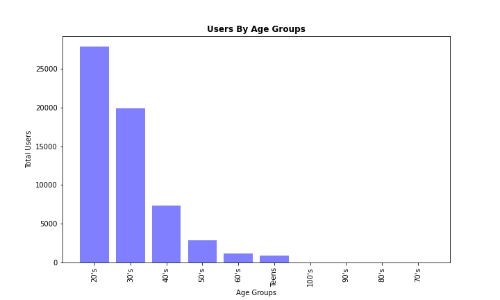

# Exploratory Analysis of Dating Applications

##### Team Members: Ramiro Cervantes, Paola Moreno, Estela Perez

## Background

Covid-19 pandemic affected the way people interacted with one another. Being that the pandemic forced everyone to isolate, not only by mandate, but also by fear of contracting the infection by human contact; people who were looking for courtship began accepting different ways to socialize. Many people turned to dating applications which became more commonly accepted platforms during the pandemic, where they socially connected without any fears of becoming infected. 

## Thesis

Our project will analyze the dating pool within the dating apps Tinder, Hinge and OkCupid. We will provide a summary of demographic data, including, age, race, sex and economic characteristics. We will also be comparing the ratings and “success” rates of the apps to determine their efficiency.
Research Questions

## What does the online dating pool look like?
  * Gender

  * Sexual Orientation

  * Age

  * Zodiac Sign

  * Income

## Which are the top dating apps?
  * OkCupid Ratings
  

  * Tinder Ratings

  * Hinge Rating

  * Compared Ratings

## How successful are these apps?
  * Success rate

## Has there been a change in the companies grows due to the pandemic?
  * Quarterly reports Stocks (line Graph)

## Links

### Datasets: 
  * [OkCupid Profiles](https://www.kaggle.com/datasets/andrewmvd/okcupid-profiles)
  * [Tinder Reviews](https://www.kaggle.com/datasets/shivkumarganesh/tinder-google-play-store-review)
  * [Hinge Reviews](https://www.kaggle.com/datasets/shivkumarganesh/hinge-google-play-store-review)
  * [OkCupid Reviews](https://www.kaggle.com/datasets/shivkumarganesh/okcupid-google-play-store-reviews)
  * [Tinder Matches](https://www.kaggle.com/datasets/benroshan/tinder-millennial-match-rate)

### API:
  * [Stock Info API](https://www.alphavantage.co/)

## Conclusion

